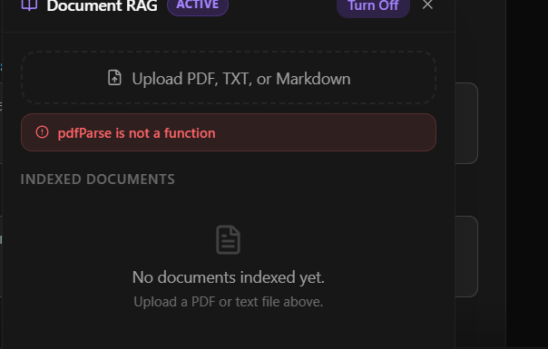

# ⚡ Delta AI — Intelligent Problem-Solving Assistant

A full-stack AI chat application with **RAG (Retrieval Augmented Generation)**, voice input, multi-model support, and a sleek modern UI.

---

## 🧠 Features

### Core Chat
- 💬 Multi-turn AI conversations powered by **Gemini** and **Llama 3.3 70B**
- 🎙️ **Voice-to-Text** input (Web Speech API with continuous listening)
- 🔊 **Text-to-Speech** — listen to any AI response
- ✍️ Streaming typing animation for AI responses
- 📋 One-click copy for AI messages
- 💡 **Suggested follow-up questions** after each response

### RAG (Retrieval Augmented Generation)
- 📄 Upload **PDF**, **TXT**, and **Markdown** files
- ✂️ Automatic text chunking (overlapping windows)
- 🧮 Embeddings via **Google `text-embedding-004`** (768 dims)
- 🔍 Semantic search using **cosine similarity** — no external vector DB needed
- 💾 Chunk storage in **MongoDB**
- 🔗 Retrieved context injected into the LLM prompt
- 📚 Source attribution shown in AI responses
- 🔄 Select specific documents or search all at once

### AI Modes
| Mode | Description |
|------|-------------|
| **Standard** | Single model chat |
| **RAG** | Chat grounded in your uploaded documents |
| **Dual Brain** | Compare Gemini vs Llama 3.3 70B side-by-side |
| **Thinking Mode** | Extended reasoning before answering |

### UI/UX
- 🌑 Dark mode only — sleek, minimal, ChatGPT-inspired
- 📱 Fully responsive (mobile + desktop)
- 🗂️ Chat history sidebar with per-chat delete and **Clear All**
- 🔐 Auth with Login / Register (JWT, HTTP-only cookies)
- ⚡ Model selection with live rate-limit indicators
- 📶 Auto-model switching when rate limit is critical

---

## 🏗️ Tech Stack

| Layer | Technology |
|---|---|
| **Frontend** | Next.js 15 (App Router), TypeScript |
| **Styling** | TailwindCSS v4, shadcn/ui |
| **Animations** | Framer Motion |
| **Backend** | Node.js, Express |
| **Database** | MongoDB (via Mongoose) |
| **AI Models** | Google Gemini API, Groq (Llama 3.3 70B) |
| **Embeddings** | Google `text-embedding-004` |
| **Auth** | JWT + bcrypt + HTTP-only cookies |
| **File Upload** | Multer (memory storage) |
| **PDF Parsing** | pdf-parse |

---

## 📁 Project Structure

```
delta/
├── server/                        # Node.js/Express backend
│   ├── models/
│   │   ├── User.js                # User auth model
│   │   ├── Chat.js                # Chat/message model
│   │   └── DocumentChunk.js       # RAG chunk + embedding storage
│   ├── routes/
│   │   ├── ask.js                 # Main AI chat route
│   │   ├── auth.js                # Login / Register / Logout
│   │   ├── conversations.js       # Chat history CRUD
│   │   ├── transcribe.js          # Voice transcription
│   │   └── rag.js                 # RAG: upload, list, delete, chat
│   ├── middleware/
│   │   └── authMiddleware.js      # JWT protect middleware
│   ├── utils/
│   │   └── ragPipeline.js         # Extract → Chunk → Embed → Search
│   └── server.js                  # Express app entry
│
└── chat-frontend/                  # Next.js frontend
    └── src/
        ├── app/
        │   ├── page.tsx
        │   ├── layout.tsx
        │   └── globals.css
        └── components/
            ├── chat/
            │   ├── ChatLayout.tsx  # Main chat UI + all state
            │   └── RAGPanel.tsx    # Document upload & RAG controls
            └── auth/
                └── LoginDialog.tsx # Login / Register modal
```

---

## 🚀 Getting Started

### Prerequisites
- Node.js 18+
- MongoDB (local or Atlas)
- Google Gemini API key
- Groq API key

### 1. Clone & install

```bash
git clone <repo-url>
cd delta

# Backend
cd server
npm install

# Frontend
cd ../chat-frontend
npm install
```

### 2. Configure environment

**`server/.env`**
```env
PORT=5000
MONGODB_URI=mongodb://localhost:27017/ai-voice-assistant
GEMINI_API_KEY=your_gemini_api_key_here
GROQ_API_KEY=your_groq_api_key_here
JWT_SECRET=your_jwt_secret_here
```

**`chat-frontend/.env.local`** (optional)
```env
NEXT_PUBLIC_API_URL=http://localhost:5000/api
```

### 3. Run

```bash
# Terminal 1 — Backend
cd server
node server.js

# Terminal 2 — Frontend
cd chat-frontend
npm run dev
```

Open [http://localhost:3000](http://localhost:3000)

---

## 📡 API Reference

### Auth
| Method | Endpoint | Description |
|--------|----------|-------------|
| POST | `/api/auth/register` | Create new account |
| POST | `/api/auth/login` | Login |
| POST | `/api/auth/logout` | Logout |
| GET | `/api/auth/me` | Get current user |

### Chat
| Method | Endpoint | Description |
|--------|----------|-------------|
| POST | `/api/ask` | Send message (multipart/form-data) |
| POST | `/api/ask/dual` | Dual-brain mode (Gemini + Llama) |
| GET | `/api/conversations` | List all conversations |
| GET | `/api/conversations/:id/messages` | Get messages in a conversation |
| DELETE | `/api/conversations/:id` | Delete a conversation |

### RAG
| Method | Endpoint | Description |
|--------|----------|-------------|
| POST | `/api/rag/upload` | Upload & index a document (PDF/TXT/MD) |
| GET | `/api/rag/documents` | List user's indexed documents |
| DELETE | `/api/rag/documents/:id` | Remove a document |
| POST | `/api/rag/chat` | RAG-grounded chat with SSE streaming |

---

## 🔬 RAG Pipeline Details

```
Document Upload
     │
     ▼
Text Extraction (pdf-parse / UTF-8)
     │
     ▼
Overlapping Chunking (300 words, 50 overlap)
     │
     ▼
Embedding Generation (Google text-embedding-004, 768 dims)
     │
     ▼
MongoDB Storage (DocumentChunk collection)
     │
     ▼
─────────── At Query Time ───────────
     │
     ▼
Embed User Query
     │
     ▼
Cosine Similarity Search (top-5 chunks, threshold > 0.3)
     │
     ▼
Inject Retrieved Context into Gemini System Prompt
     │
     ▼
Streaming SSE Response to Frontend
     │
     ▼
Source Attribution in UI
```

---

## � UI Highlights

- **Login/Register** — Tab-style switcher, inline error banners, spinner on submit
- **Chat messages** — Proper left/right alignment, copy button, read-aloud, model badge
- **RAG Panel** — Floating document manager with upload, selection, and delete
- **Sidebar** — Chat history with per-item delete + Clear All button
- **Voice input** — Live transcript preview, listening/processing/error states
- **Typing animation** — Smooth character-by-character reveal (stable across re-renders)

---

## ⚠️ Notes

- Voice-to-Text requires **Chrome or Edge** (Web Speech API)
- RAG embedding generation may take ~10–30 seconds for large documents
- Max document size: **20 MB**, max chunks: **200** (~50,000 words)
- Rate limit indicators are demo metrics (not actual API quota tracking)
